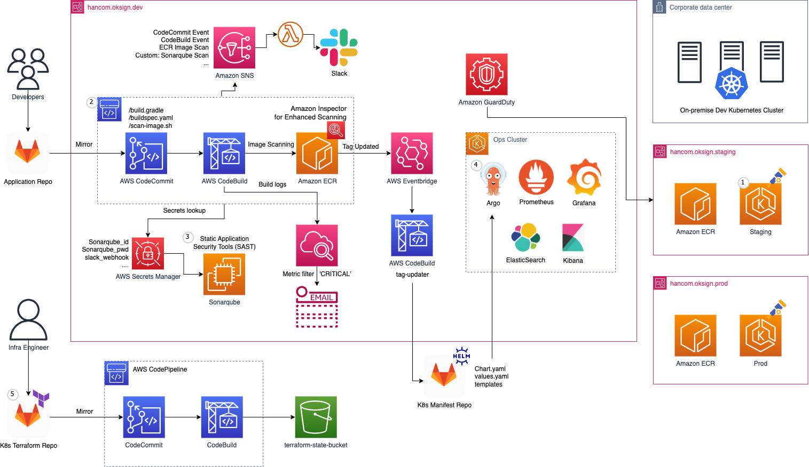

# devsecops-on-eks

## DevSecOps

### CodeBuild
* buildspec.yaml - image scanning
* scan-image.sh
* helm-buildspec.yaml - tag-updater
* secretsmanager.md

### Notification
Slack notification for Code series

## Security Checklist
* Container Image Security
* Amazon Elastic Container Registry (ECR)
* Container Runtime Security
* Container Host
* Identity and Access Management
* Kubernetes Security Monitoring
* Protect Secrets
* Network Security (Pod to Pod Communication)
* Threat Detection using Amazon GuardDuty
* Multi Tentant SaaS Security